# Desafio: Desenvolvimento de CRUD em JavaScript para Produtos

## ℹ️ Sobre o desafio: 

O programa deve permitir o **cadastro**, **leitura**, **atualização** e **exclusão** de produtos. Os dados devem ser **armazenados na memória**, por meio de um **array de objetos** que deve conter as seguintes informações:

- **id** (**deve ser auto_incrementado** - ou seja, `um número deve ser inserido de forma automática`);
- **nome**;
- **categoria**;
- **preco**;


### Realize as implementações APENAS onde tem o `To DO`

**Exemplo**: Neste caso é para `declarar um Array` com o nome `produtos`.

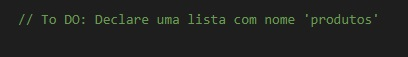


### 🎯 Para a resolução deste desafio você precisará ter conhecimentos sobre:

* [x] Declaração de variáveis;
* [x] Operadores de comparação;
* [x] Condicional Switch e IF;
* [x] Criação e manipulação de Arrays;
* [x] Objetos;
* [x] Laço de repetição Do While;
* [x] Funções;


## Pré-requesitos para resolução do desafio

>[!IMPORTANT]
> 
> * [x] Ter uma IDE/editor de código, o Node e o  git instalados na máquina;
> * [x] Clique em `Fork` para realizar uma cópia do projeto para você 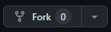 - `caso tenha alguma dúvida assista ao vídeo clicando no link a seguir`: [▶️Explicação sobre o Fork e Clonagem de repositório](https://youtu.be/L6HX3Kw359A)
> * [x] No seu computador, `clone a cópia do projeto que está em seu repositório` - **também mostro no link acima**:
>    ```shell
>    git clone suaURL
>    ```
> * [x] Com o projeto em sua máquina, abra a pasta dele na sua IDE e insira o comando `npm i` para instalar as dependências necessárias do projeto - neste caso, será instalado apenas o readline sync - (`utilize o terminal`).
>   
> * [x] Para executar o programa digite o comando a seguir: `node index`
>   


## ⚙️ Funcionalidades:

O programa deve rodar dentro de um `loop Do While` de forma infinita até que o usuário escolha finalizar o programa.

> Para interagir com o programa, utilize o `readline sync` que já consta no projeto para obter as informações do usuário por meio do teclado.

- **exibirMenu()**: Ao ser chamada deve exibir as funcionalidades da aplicação;

| Opções do Menu |
|--- |
| 1 - Cadastrar produto | 
| 2 - Listar produtos | 
| 3 - Buscar produto por ID | 
| 4 - Atualizar produto | 
| 5 - Excluir produto | 
| 0 - Sair | 
||

 
 <br/>


- **cadastrarProduto(id, nome, categoria, preco)**: Corresponde a letra **C** do CRUD: `Create`. Por meio desta função você deverá criar toda a lógica necessária para `cadastrar novos produtos`. Após realizar o cadastro, o programa deve retornar as informações do produto cadastrado e chamar o menu novamente.

- **listarProdutos()**: Corresponde a letra **R** do CRUD: `Read`. Por meio desta função você deve `exibir todos os produtos cadastrados`.

- **buscarProdutoPorId(id)**: Corresponde a letra **R** do CRUD: `Read`. Por meio desta função você deve `exibir APENAS um produto que corresponde ao ID informado`. **Caso seja informado um ID que não existe, a mensagem a seguir deve ser exibida**: `Produto não encontrado!`.

- **atualizarProduto(id)**: Corresponde a letra **U** do CRUD: `Update`. Por meio desta função você deve `permitir a atualização das informações de um produto com base no ID informado`. **Caso seja informado um ID que não existe, a mensagem a seguir deve ser exibida**: `Produto não encontrado!`.

- **excluirProdutoPorId(id)**: Corresponde a letra **D** do CRUD: `Delete`. Por meio desta função você deve criar a lógica para `exclusão de um produto com base no ID informado`. **Caso seja informado um ID que não existe, a mensagem a seguir deve ser exibida**: `Produto não encontrado!`.


 <br/>

## 📊 Resultados esperados

### Exibição do Menu
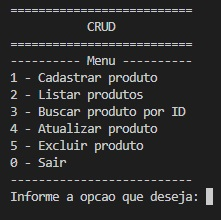


<br/>

### 1. Cadastro de produtos
> Observe que o ID não é informado. Apenas o nome, categoria e preco devem ser informados ao cadastrar novos produtos.

#### Cadastro 1
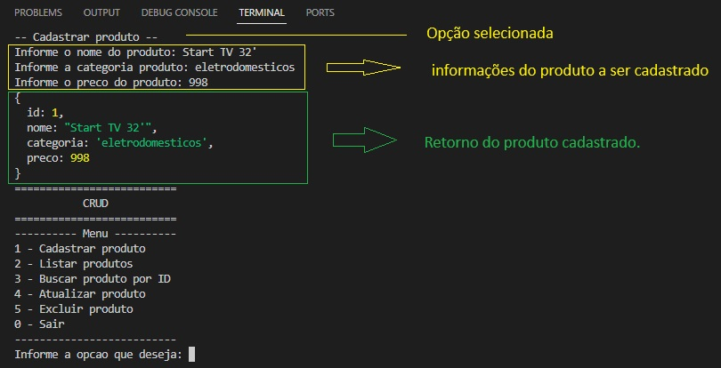

<br/>

#### Cadastro 2
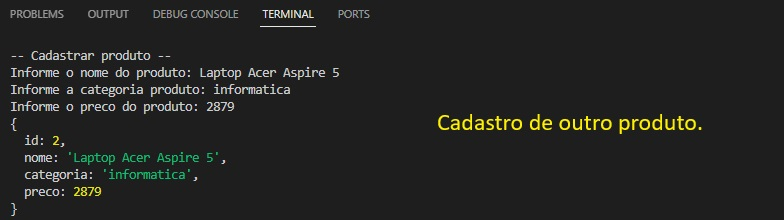


<br/>

### 2. Lista todos os Produtos cadastrados
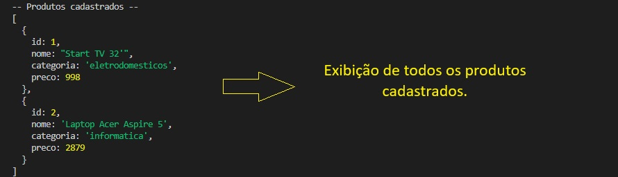


<br/>

### 3. Buscando um produto com base no ID
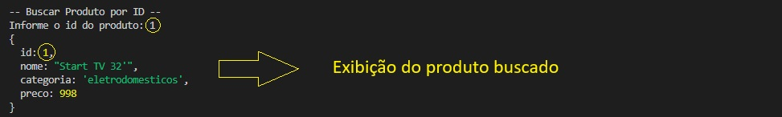

> Caso seja informado um ID que não existe, a mensagem abaixo deve ser exibida.

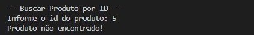

<br/>

### 4. Atualização de Produto
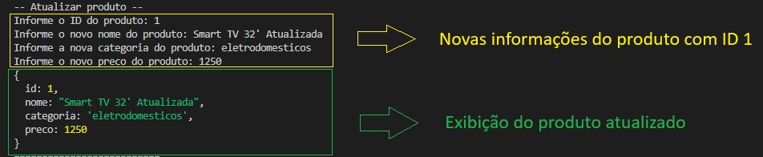

> **Caso seja informado um ID que não existe, a mensagem a seguir deve ser exibida**: `Produto não encontrado!`.


<br/>

### 5. Exclusão de Produto
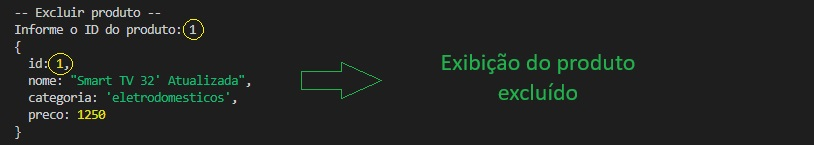

> **Caso seja informado um ID que não existe, a mensagem a seguir deve ser exibida**: `Produto não encontrado!`.

### Exibição da lista após exclusão
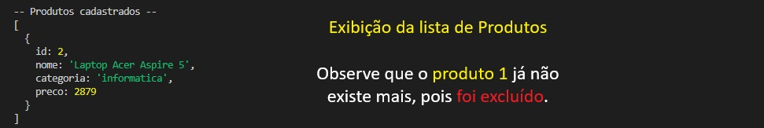


## ✅ Resolução do desafio

* [Resolução 1 - arquivo único]() - ⚠️ Será disponibilizado em breve.
* [Resolução 2 - arquivo divididos por funcionalidades]() - ⚠️ Será disponibilizado em breve.
